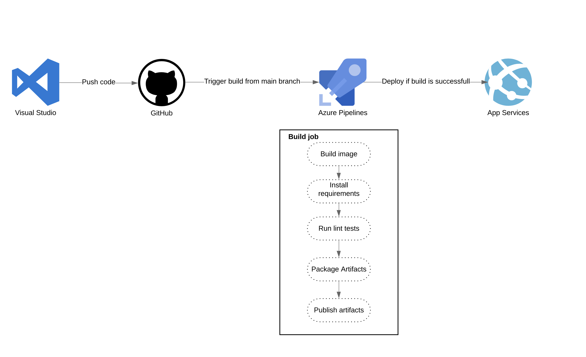
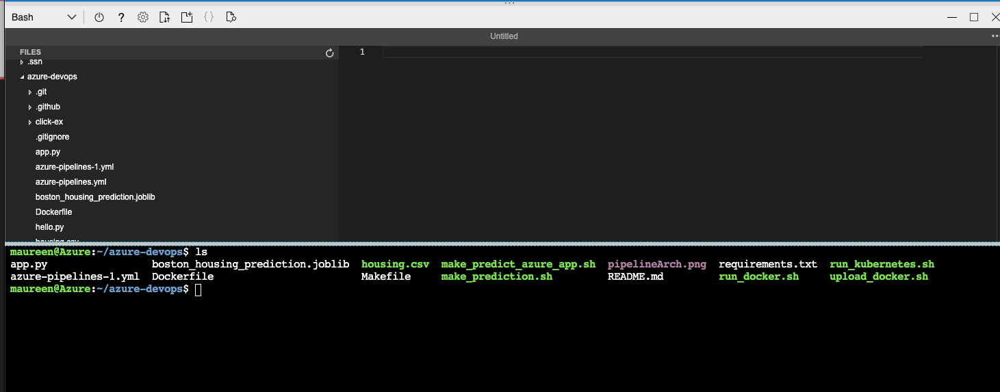
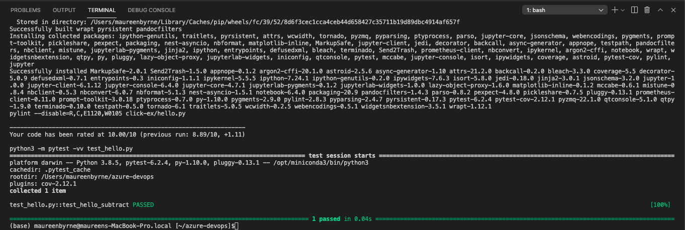
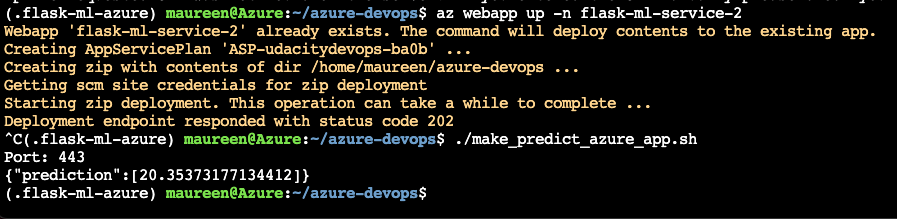
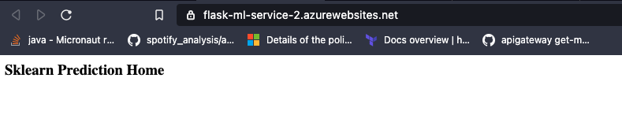

# Overview
Setup of a continous delivery and intrgration pipeline using Azure piplines and git actions
to deploy a simple machine learning app using Flask web framwork ysed to predict housing prices in Boston. 
The template can be extended to any pre-trained machine learning model, such as those for image recognition and data labeling. 


## Project Plan
* Trello board
https://trello.com/b/4mjiLmgV/udacity-devops
* Prject plan 
https://docs.google.com/spreadsheets/d/1tYQuDqm2EebUbymdccGSOAIrnwG3jesx0YNzeNc6ZWs/edit?usp=sharing

## Dependecies
In order to setup this you need to have
- An Azure Account ( https://portal.azure.com/)
- A GitHub Account ( http://github.com/)
- An Azure DevOps Account (https://dev.azure.com/)


## Architectural Diagram 
The project demonstrates the use of azure pipelines, the flow is seen below:
When changes to the ML code is made in the main branch the azure pipeline is triggered, it will perform the steps highlighted in build job. Then if all steps are successfull the image will be deployed to the specified envinoment in Azure App services. 



## Project set-up
Clone or fork project

* Project running on Azure App Service


* Project cloned into Azure Cloud Shell
Clone project in the cloud shell by typing 

```bash
user@Azure:~$ git clone git@github.com:maur1/azure-devops.git
```
Navigate to folder to folder and check that contents looks like this:

```bash
user@Azure:~$ cd azure-devops
user@Azure:~/azure-devops$ ls
```


* Install requirmenets, lint and test code by running
```bash
user@Azure:~/azure-devops$ make all
```
Should give a successfull output:


* Create and initially deploy the app by running 

```bash
user@Azure:~/azure-devops$ az webapp up -n flask-ml-service-2
```
Make sure the application returns a 202

* Run the predefined script which POSTs data to the app in order to recieve a prediction 
Out put should look like this



[Check that the website is up and running by visiting](https://flask-ml-service-2.azurewebsites.net/)


* Set up Azure pipline integration

* Running Azure App Service from Azure Pipelines automatic deployment

* Output of streamed log files from deployed application

[Note the official documentation should be referred to and double checked as you setup CI/CD](https://docs.microsoft.com/en-us/azure/devops/pipelines/ecosystems/python-webapp?view=azure-devops).

## Enhancements
* Add test for app.py
* Add SIT, UAT and Prod envinroment
* Increase tests
* Expand and improve ML model

## Demo 

<TODO: Add link Screencast on YouTube>


[](https://github.com/maur1/azure-devops/actions/workflows/main.yml)
