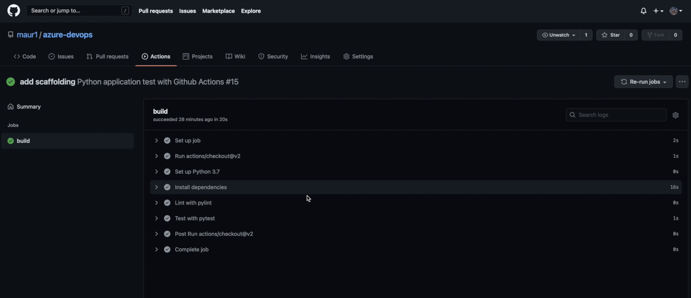
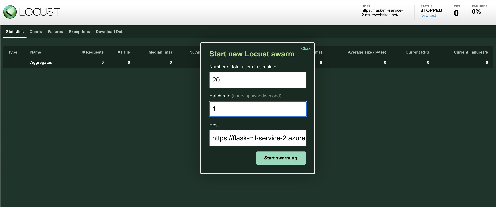
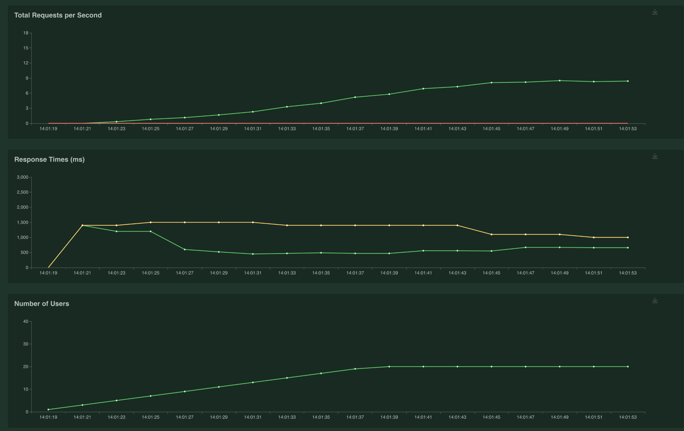

[](https://github.com/maur1/azure-devops/actions/workflows/python-actions.yml)


# Overview
Setup of a continous delivery and integration pipeline using Azure piplines and git actions
to deploy a simple machine learning app using Flask web framwork ysed to predict housing prices in Boston. 
The template can be extended to any pre-trained machine learning model, such as those for image recognition and data labeling. 

[Note the official documentation should be referred to and double checked as you setup CI/CD](https://docs.microsoft.com/en-us/azure/devops/pipelines/ecosystems/python-webapp?view=azure-devops).
## Project Plan
* Trello board
https://trello.com/b/4mjiLmgV/udacity-devops
* Prject plan 
https://docs.google.com/spreadsheets/d/1tYQuDqm2EebUbymdccGSOAIrnwG3jesx0YNzeNc6ZWs/edit?usp=sharing

## Dependecies
In order to setup this you need to have
- An Azure Account ( https://portal.azure.com/)
- A GitHub Account ( http://github.com/) with the project cloned into
- An Azure DevOps Account (https://dev.azure.com/) [with an ssh key set up for github communication](https://docs.microsoft.com/en-us/azure/devops/repos/git/use-ssh-keys-to-authenticate?view=azure-devops)

## Architectural Diagram 
The project demonstrates the use of azure pipelines, the flow is seen below:
When changes to the ML code is made in the main branch, the azure pipeline and github actions are triggered. The azure pipeline will perform the steps highlighted in build job. Then if all steps are successfull the image will be deployed to the specified envinoment in Azure App services. 


## Project set-up

Clone project in the cloud shell by typing 

```bash
user@Azure:~$ git clone git@github.com:maur1/azure-devops.git
```
Navigate to folder to folder and check that contents looks like this:

```bash
user@Azure:~$ cd azure-devops
user@Azure:~/azure-devops$ ls
```


Install requirmenets, lint and test code by running
```bash
user@Azure:~/azure-devops$ make all
```
Should give a successfull output:


Create and initially deploy the app by running 

```bash
user@Azure:~/azure-devops$ az webapp up -n flask-ml-service-2
```
Make sure the application returns a 202

Run the predefined script which POSTs data to the app in order to recieve a prediction 
Out put should look like this


[Check that the website is up and running by visiting the web page](https://flask-ml-service-2.azurewebsites.net/)


Set up Azure pipline integration thorugh Azure Devops for Organizations
[Follow the instructions here for set-up](https://docs.microsoft.com/en-us/azure/devops/pipelines/ecosystems/python-webapp?view=azure-devops)

If you have successfully set up the pipeline the output should look like this


Verify that the app is up and running by checking the log tail for the application. 
Use command 
```bash
user@Azure:~/azure-devops$ az webapp log tail --name flask-ml-service-2
```


After a build the deployd application should be up and running, the web app can be viewed in the azure portal. Test that the web app works by requesting a new prediction as seen below


Github actions can also be enabled for the project - this will enable automated testing on your local branch - a successfull run will look like this:


## Load testing with locust
Locust is a tool for load-testing web-applications. The created `locustfile.py` contains the necessary code to get predictions by calling the deployed WebApp.

Run locust from your terminal
```bash
locust
```
Go to Locust WebUi

 ```http://localhost:8089/```

 

 Enter the parameters for the test, in my test run I used 20 users with a spawn time of 1 second with the HOST being 

 ```https://flask-ml-service-2.azurewebsites.net```

 You should see similar graphs as shown below, indicating how well your web app handles the load 

  

## Enhancements
* Add test for app.py
* Crate dev and main branch - only deploy new web app when dev is merged to main
* Add SIT, UAT and Prod envinroment
* Increase tests
* Expand and improve ML model


